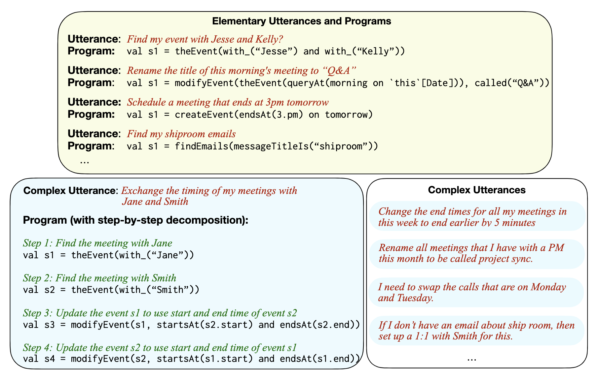

# Data for [Natural Language Decomposition and Interpretation of Complex Utterances](https://arxiv.org/pdf/2305.08677)





## Data

We study a scenario in which a large number of elementary utterances have been annotated with programs, and we wish to build a model that can generalize to complex utterances requiring more elaborate programs.

We release both `DeCU-elementary` and `DeCU-complex`

### DeCU-elementary

These utterances are elementary, in that they represent narrow user goals such as creating or deleting a single meeting, which can typically be achieved using a single API. As such, they have relatively short associated programs.

- `decu_data/elementary/domain.all.tsv`
This file contains data examples of the form (id, utterance, plan). `plan` is a Scala-like program in a single line. There are a total of 841 examples.
The entire elementary utterance data is available for use in the primary decomposition experiments described in the paper.

- `decu_data/elementary/domain.{split}.tsv`
Contains the train, dev, test splits of the data. These splits are used only for the side experiment where we analyze the accuracy of the parser on elementary data only.


### DeCU-complex

As the name suggests, compared to elementary utterances, complex utterances represent more complex and broader user goals, with the corresponding programs typically being much longer.  

- `decu_data/complex/` contains the train and test splits 

Each line in the data file is a json dictionary:

```
{
	"utterance": "Decline any meetings that were created after I sent my last invite earlier today",
	"steps": [{
		"step_index": 0,
		"step": "Find all events"
	}, {
		"step_index": 1,
		"step": "Filter list of events s1 to only events organized by me."
	}, {
		"step_index": 2,
		"step": "Find the event with the most recent created time from the list of events s2"
	}, {
		"step_index": 3,
		"step": "Find all meetings created after the event s3"
	}, {
		"step_index": 4,
		"step": "Decline all meetings from the list of events in s4"
	}],
	"plans": ["val s1 = findEvents0", 
        "val s2 = s1.filter(x => x.organizerIs(me))", 
        "val s3 = max(s2, x => x.created)", 
        "val s4 = findEvents(queryAt(after(s3.created)))", 
        "val s5 = s4.map(x => respond(x, withResponse(ResponseStatusType.declined)))"],
	"datum_id": "d129",
	"utterance_id": "d129",
    "is_unannotated": false
}
```

## License

Data is released under CDLA-Permissive-2.0 License


## Citation

```
@article{jhamtani2023natural,
  title={Natural Language Decomposition and Interpretation of Complex Utterances},
  author={Jhamtani, Harsh and Fang, Hao and Xia, Patrick and Levy, Eran and Andreas, Jacob and Van Durme, Ben},
  booktitle={IJCAI},
  year={2024}
}
```


## Trademarks

This project may contain trademarks or logos for projects, products, or services. Authorized use of Microsoft 
trademarks or logos is subject to and must follow 
[Microsoft's Trademark & Brand Guidelines](https://www.microsoft.com/en-us/legal/intellectualproperty/trademarks/usage/general).
Use of Microsoft trademarks or logos in modified versions of this project must not cause confusion or imply Microsoft sponsorship.
Any use of third-party trademarks or logos are subject to those third-party's policies.

## TODOs
Coming soon: We will also provide code to load the data, domain library that can be used to verify syntax, etc.